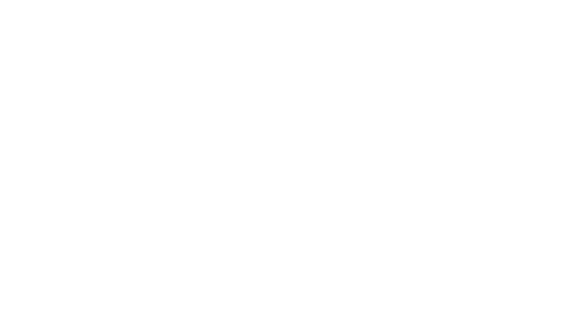
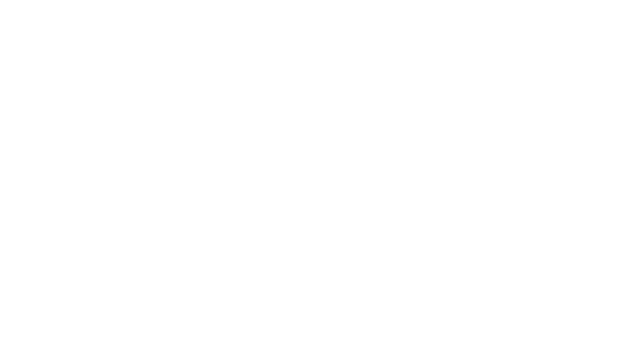

import { Appear, Image } from "mdx-deck"
import { CodeSurfer } from "mdx-deck-code-surfer";
import { Split } from 'mdx-deck/layouts'
import A from "./components/A";
import Phone from "./components/Sound";
import { 
  SimpleButton, 
  GreenElpButton, 
  RedElpButton, 
  BlueElpButton,
  elpButtonSnippet, 
  invertedElpButtonSnippet,
  blueElpButtonSnippet,
  roundedElpButtonSnippet,
  abstractButton,
  fixedButtonSnippet,
} from "./components/Button";

export { default as theme } from "./theme";

# You've been doing CSS wrong
<div>
  <A href="https://twitter.com/michalwarda">@michalwarda</A>
  <A style={{ marginLeft: '5px' }} href="https://twitter.com/hashtag/softwareengineer">#softwareengineer</A>
  <A style={{ marginLeft: '5px' }} href="https://twitter.com/elpassion">@elpassion</A>
</div>

```notes
My name is Michał Warda I'm a software engineer at EL Passion. Today we'll talk about CSS! Ley's jump into it.
```

---

```html
<button class="button">Hello confront!</button>
```

---

<Appear>
  <SimpleButton>Hello confront!</SimpleButton>
  <div><br /> 0 lines of code in CSS</div>
</Appear>

```notes
This is the simplest button possible.
Does anyone have an idea how many LOC in CSS it took to style it.
Yup 0 LOC. This is the basic chrome rendered button on OSX!
```

---

<Appear>
  <GreenElpButton>Hello confront!</GreenElpButton>
  <div><br /> 35 lines of code in SASS</div>
</Appear>

```notes
Next example:
Custom color, font, hover, active, DISABLED, radius.
Does anyone have an idea how many LOC in CSS it took to style it.
35 lines of SASS around 40 lines of CSS.
Let's look at the code.
```

---

<CodeSurfer
  code={elpButtonSnippet}
  lang="scss"
  dark={true}
  steps={[
    {},
    { range: [3, 7], notes: "Box Properties" },
    { range: [9, 9], notes: "Background" },
    { range: [11, 18], notes: "Text" },
    { range: [19, 20], notes: "Extra properties" },
    { range: [21, 22], notes: "Animations" },
    { range: [23, 34], notes: "States" },
    {},
  ]}
/>

```notes
The amount of code grows drastically whenever you try to implement anything. even the simplest stuff.
35 lines of code gave us a pretty button. Seems like a lot but considering this button is doing so much I would say it was worth it.
```

---

<Appear>
  <RedElpButton>Hello confront!</RedElpButton>
  <div><br /> 35 lines of code in SASS</div>
</Appear>

```notes
This time we have a button with different colors! The simplest way to implement it is obviously to copy all the code but just change the colors.
How many lines of code it might take in that situation then?
35 LOC!
```

---

<CodeSurfer
  code={invertedElpButtonSnippet}
  lang="scss"
  dark={true}
  steps={[
    {},
    { tokens: { 9: [3] } },
    { tokens: { 24: [3] } },
    { tokens: { 28: [3] } },
    {},
  ]}
/>


```notes
In our code we added a second class that consists of the definition of secondary-button which differs only by few properties.
I feel like I could work with this code and not be angry at all.
70 LOC overall. Everything is working beautifully! Let's continue!
```

---

<Appear>
  <BlueElpButton>Hello confront!</BlueElpButton>
  <div><br /> 35 lines of code in SASS</div>
</Appear>

```notes
sigh...
I hate those designers! Third button on 1 page... What can we do?
Another 35 LOC!
```

---

<CodeSurfer
  code={blueElpButtonSnippet}
  lang="scss"
  dark={true}
  steps={[
    {},
    { tokens: { 9: [3] } },
    { tokens: { 24: [3] } },
    { tokens: { 28: [3] } },
    {},
  ]}
/>


```notes
Same mechanism as previously. 
```

---

<div>
  <GreenElpButton>Hello confront!</GreenElpButton>
  <RedElpButton>Hello confront!</RedElpButton>
  <BlueElpButton>Hello confront!</BlueElpButton>
</div>
<br/>
105 LOC

---

<CodeSurfer
  code={elpButtonSnippet + invertedElpButtonSnippet + blueElpButtonSnippet}
  lang="scss"
  dark={true}
  steps={[
    {},
    { range: [0, 35], notes: "Green" },
    { range: [35, 70], notes: "Red" },
    { range: [70, 105], notes: "Blue" },
    {},
  ]}
/>

```notes
In our code we added a third class that consists of the definition of third-button which differs only by few properties.
Being a programmer for many years I think I found a pattern.
```

---

<Image src='done.png' size="contain" />

```notes
Obviously something tells us that this is not a perfect solution, but what is so bad about it?
Is it too long? Is it too complicated? The code still does simple things.
After all people have fast internet currently and we can easily work with 100 lines of code right? Besides GZIP will handle this perfectly.
There is no chance I did something wrong here.
There are no overrides of styles. No !important.
I know that if something changes in design I would need to change it in 3 places. I’ve got find and replace for that.
I think that if someone wrote a commit like this for an app that has 3 only buttons and I did the CR for it I would accept it.
```

---

<CodeSurfer
  code={elpButtonSnippet + invertedElpButtonSnippet + blueElpButtonSnippet}
  lang="scss"
  dark={true}
  steps={[
    {},
  ]}
/>


```notes
Obviously something tells us that this is not a perfect solution, but what is so bad about it?
Is it too long? Is it too complicated? The code still does simple things.
After all people have fast internet currently and we can easily work with 100 lines of code right? Besides GZIP will handle this perfectly.
There is no chance I did something wrong here.
There are no overrides of styles. No !important.
I know that if something changes in design I would need to change it in 3 places. I’ve got find and replace for that.
I think that if someone wrote a commit like this for an app that has 3 only buttons and I did the CR for it I would accept it.
```

---

New design comes in!

<GreenElpButton>Hello confront!</GreenElpButton>
<GreenElpButton radius>Hello confront!</GreenElpButton>

```notes
Green button with a 
Welp. How do we handle this problem? Exactly the same way we did previously!
```
---

<CodeSurfer
  code={roundedElpButtonSnippet}
  lang="scss"
  dark={true}
  steps={[
    {},
    { tokens: { 6: [4, 5] } },
    {},
  ]}
/>

```notes
Everything still works correctly. Another 35 LOC. 140
```

---

<GreenElpButton>Hello confront!</GreenElpButton>
<GreenElpButton radius>Hello confront!</GreenElpButton>
<br/>
<RedElpButton>Hello confront!</RedElpButton>
<RedElpButton radius>Hello confront!</RedElpButton>
<br/>
<BlueElpButton>Hello confront!</BlueElpButton>
<BlueElpButton radius>Hello confront!</BlueElpButton>
<br/>
<br/>
210 LOC

```notes
The design grows so that it needs other rounded buttons. 210 LOC.
My eyes see that everything is working. I like this style of coding.
I didn't see this approach anywhere on the internet! Why does noone suggest to write CSS like this? 
I will call it DUMBCSS.
```

---

# DUMB CSS

```notes
SIGH programming is so easy!
```
---

<Image src='calm_down.png' size="contain" />

```notes
The thing is we are not programming.
And now all the backend developers smiled because CSS is not programming!
So what is programming?
```

---

<Image src='scp.png' size='contain' />

```notes
This is Structure and Interpretation of Computer Programs. 
Students at MIT are introduced to programming by this book.
At the start it tries to explain what is programming.
```

---

"Combining several simple ideas into one compound one"

```notes
In it's first chapter it defines programming as: .
I didn't build any abstractions in my code.
```

---

How to program in CSS?

---

<Image src="picasso.png" size='contain' />

```notes
Let's start building abstractions!
```

---

<GreenElpButton>Hello confront!</GreenElpButton>
<GreenElpButton radius>Hello confront!</GreenElpButton>

```notes
Those 2 look very similar and simple. Let's make 1 button that combines those 2.
```

---

```scss
.button {
  // ...
  border-radius: 8px;
  border-radius: 20px;
  // ...
}
```

```notes
If we just put both values together this will not work obviously.
```

---

<CodeSurfer
  code={abstractButton}
  lang="scss"
  dark={true}
  steps={[
    { range: [6, 6], notes: "Radius" },
    { range: [37, 39], notes: "<button class=\"button radius-big\">Hello confront!</button>" },
    { range: [41, 43], notes: "<button class=\"button radius-small\">Hello confront!</button>" },
  ]}
/>

```notes
The first method of abstracting common behaviour in CSS we get to learn is that one element can have multiple classes.
We can define the common properties in one class and the other ones in other classes.
This way we reduced the number of LOC back to around 110!
This is the first abstraction we built inside our code. We just became programmers!
```

---

<GreenElpButton>Hello confront!</GreenElpButton>
<GreenElpButton radius>Hello confront!</GreenElpButton>
<br/>
<RedElpButton>Hello confront!</RedElpButton>
<RedElpButton radius>Hello confront!</RedElpButton>
<br/>
<BlueElpButton>Hello confront!</BlueElpButton>
<BlueElpButton radius>Hello confront!</BlueElpButton>
<br/>
<br/>
110 LOC

---

<CodeSurfer
  code={abstractButton}
  lang="scss"
  dark={true}
  steps={[
    { range: [9, 9], notes: "background-color" },
    { range: [28, 34], notes: "background-color" },
    { range: [45, 55], notes: "<button class=\"button green\">Hello confront!</button>" },
    { range: [57, 67], notes: "<button class=\"button red\">Hello confront!</button>" },
    { range: [69, 79], notes: "<button class=\"button blue\">Hello confront!</button>" },
  ]}
/>

```notes
Extract common background lines to a class.
```

---

<GreenElpButton broken>Hello confront!</GreenElpButton>
<GreenElpButton radius broken>Hello confront!</GreenElpButton>
<br/>
<RedElpButton broken>Hello confront!</RedElpButton>
<RedElpButton radius broken>Hello confront!</RedElpButton>
<br/>
<BlueElpButton broken>Hello confront!</BlueElpButton>
<BlueElpButton radius broken>Hello confront!</BlueElpButton>
<br/>
<br/>
80 LOC


```notes
Now we created 2 abstractions and everything is still working!
Brilliant job! Now we can call ourselves programmers and get some rest!
```
---
<Image src="sleep.png" size="contain" />

```notes
PRESS S
```
---

<Phone />
<Image src="angry_client.png" size="contain" />

```notes
There is a bug in the application!
Try to hover over a disabled button!
```

---

<GreenElpButton broken>Hello confront!</GreenElpButton>

---

<CodeSurfer
  code={fixedButtonSnippet}
  lang="scss"
  dark={true}
  steps={[
    { range: [20, 23] },
    { range: [37, 43] },
    { tokens: { 37: [2] } },
    { tokens: { 41: [2] } },
  ]}
/>

```notes
Disabled had a lower specificity than hover so the button style got overriden.
We will fix it by adding the enabled selector to ensure that the styles are not applied to disabled button.
```

---

<GreenElpButton>Hello confront!</GreenElpButton>

---

<div>What did we learn?</div>
<Appear>
  <div>Building Abstractions is hard!</div>
  <div>Even the simplest!</div>
</Appear>

```notes
Building abstractions in CSS is hard. Even the simplest ones.
Nothing is for free.
```

---

export default Split




```notes
You gain a lot from abstractions but also you introduce complexity into the program.
We don't want to give up building abstractions.
But we are very afraid of introducing complexity.
```

---

How do we get some sleep?

---

<Appear>
  <span>Remember possible mistakes and not make them again!</span>
  <span> (Obviously)</span>
  <br/>
  <span>Click through the app after changes more carefully!</span>
  <span> (Obviously)</span>
  <br/>
  <span>Do not deploy right before sleep!</span>
  <span> (Obviously)</span>
</Appear>

---

Any other suggestions?

---

Treat your CSS just like you would treat any other language!

---

Our process previously
<Appear>
  <span><span style={{color: "green"}}>Write simplest green button<br/></span></span>
  <span><span style={{color: "green"}}>Duplicate button for different colors<br/></span></span>
  <span><span style={{color: "green"}}>Duplicate button for different radiuses<br/></span></span>
  <span><span style={{color: "green"}}>Extract border to different class<br/></span></span>
  <span><span style={{color: "red"}}>Extract colors to different class<br/></span></span>
  <span><span style={{color: "green"}}>Apply the fix</span></span>
</Appear>

```notes
Where did we make the mistake?
We were safe till the point we changed the backgrounds. Nothing bad happened before that. 
What was so different about changing background that we should have taken that into account?
I don't know but we can try to fix it how others do it. Write the code in TDD!
```

---

We can write automated tests for the button
```javascript
test("disabled button on hover has correct color", () => {
  const button = document.getElementById("button");
  button.hover();
  expect(button.backgroundColor).toBe("gray");
})
```

---

<Appear>
  <span>Even the testing eager guys like me have a problem with that<br/></span>
  <span>There will be a lot of those<br/></span>
  <span>You still need to manually look at the button to know if it looks allright in your design<br/></span>
</Appear>

---

We can understand the platform and not fight it

---

Embrace the platform

---

Thank you